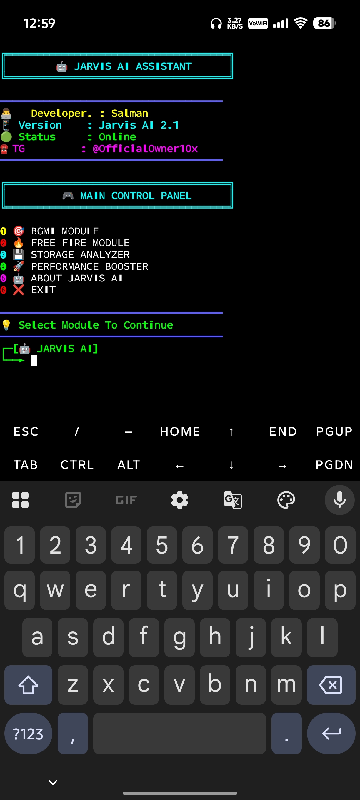

  

🚀 JARVIS AI ASSISTANT

"JARVIS" (jarvis.png)

🤖 Smart Device Analyzer & Gaming Assistant

"Python" (https://img.shields.io/badge/Python-3.10+-blue)
"Platform" (https://img.shields.io/badge/Platform-Termux-green)
"Android" (https://img.shields.io/badge/Android-Supported-brightgreen)
"Status" (https://img.shields.io/badge/Status-Online-success)

---

✨ About

JARVIS AI Assistant is an advanced Android & Termux utility designed to analyze devices, provide gaming assistance, monitor storage, and deliver useful system information through an attractive terminal interface.

---

🔥 Features

✔️ Device Information Scanner

✔️ Storage Analyzer

✔️ Gaming Assistant

✔️ Performance Monitor

✔️ AI Based Interface

✔️ Beautiful Color UI

✔️ Fast & Lightweight

✔️ Android Optimized

---

📸 Preview

"JARVIS" (jarvis.png)

---

⚙️ Installation

pkg update -y && pkg upgrade -y

pkg install python git -y

git clone https://github.com/Sallu-Shk/Jarvis-AI-Assistant.git

cd Jarvis-AI-Assistant

pip install -r requirements.txt

python salman_ai.py

---

📱 Requirements

- Android 8+
- Termux Latest Version
- Internet Connection
- Python 3.x

---

📂 Repository Structure

Jarvis-AI-Assistant/
│
├── salman_ai.py
├── requirements.txt
├── README.md
├── LICENSE
└── jarvis.png

---

👨‍💻 Developer

Salman

---

🌐 Community

Telegram Channel:

https://t.me/gamingmodhtps

---

⭐ Support

If you found this project useful:

⭐ Star this repository

🍴 Fork this repository

📢 Share with friends

---

📜 License

Apache 2.0 License

---

🚀 Powered By Salman

"Making Android Utilities Smarter"

